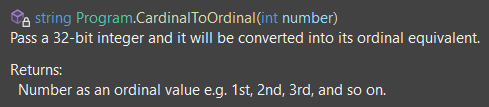

# Ch4 - Writing, Debugging, and Testing Functions
## Notes from Chapter 4 "C# 10 and .NET 6" by Mark J. Price

## Contents
Return [Home](README.md)
* [4.1 - Don't Repeat Yourself (DRY)](#04.1)
* [4.2 - Factorials with Recursion](#04.2)
* [4.3 - XML Comments](#04.3)


* [4.15 - Question & Answer](#04.11)

The code for this tutorial can be found in ``code/Chapter04``

---
<a name="04.1"></a>
### 4.1 - Don't Repeat Yourself (DRY)

* Use functions to avoid writing the same code again.
* Create a function that given an integer outputs the timetable for that value up to 12:
    ```C#
    using static System.Console;
    public class TimesTableApp
    {
        public static void Main(string[] args)
        {
            getTimesTable(11);
        }
        
        private static void getTimesTable(int xVal)
        {
            for (int x = 1; x <= 12; x++) 
            { 
            WriteLine($"{xVal} x {x} = {x * xVal}");
            }
            
            string xValString = xVal.ToString();
        }
    }
    ```
* In my example, I use ``int xVal`` but it is better to use strong types to add constraints to values. We know we will only need the range of timetables 1-15, therefore instead of ``int`` with range of -2,147,483,648 to 2,147,483,647, it would be more appropriate to use ``byte xVal``, with range of 0 to 255.
* Below we will write a function that returns a value, and uses a switch case:
    ```C#
    public class CalculateTaxApp
    {
        public static void Main(string[] args)
        {
            decimal taxToPay = CalculateTax(amount: 1000, twoLetterRegionCode: "GB");
            WriteLine($"You must pay {taxToPay} in tax.");
        }
        static decimal CalculateTax(
        decimal amount, string twoLetterRegionCode)
        {
            decimal rate = 0.0M;
            switch (twoLetterRegionCode)
            {
                case "CH": // Switzerland
                    rate = 0.08M;
                    break;
                case "GB": // United Kingdom
                case "FR": // France
                    rate = 0.2M;
                    break;
                case "OR": // Oregon
                case "AK": // Alaska
                case "MT": // Montana
                    rate = 0.0M;
                    break;
                case "ND": // North Dakota
                case "WI": // Wisconsin
                case "ME": // Maine
                case "VA": // Virginia
                    rate = 0.05M;
                    break;
                default: // most US states
                    rate = 0.06M;
                    break;
            }
            return amount * rate;
        }
    }
    ```
* As you can see for ``GB`` case it would have a rate of ``0.02M`` because there is no ``break``, and the program flows to the next case.


---
<a name="04.2"></a>
### 4.2 - Factorials with Recursion
* Use recursion to find factorials:
    ```C#
    static int Factorial(int i) 
    {
        if (i < 1)
        {
            return 0;
        }
        else if (i == 1)
        {
            return 1;
        }
        else
        {
            return i * Factorial(i - 1);
        }
    }
    ```
* As you can see the edge case of ``i < 0`` is covered. 
* However, if the output value is very high (e.g. ``Factorial(45)``), that it exceeds the ``int`` range, then remember that it cycles back to negative values a.k.a overflows. According to our function, the output of ``Factorial(45) = 0`` which is incorrect. We can make it throw an exception by using ``checked``.
    ```C#
    ....
    else
    checked
    {
        return i * Factorial(i - 1);
    }
    ```
* Lets write another function to print out the first 20 factorials. Also, we will now handle ``OverflowException``:
    ```C#
        static void Main(string[] args)
        {
            RunFactorial(20); 
        }
        static void RunFactorial(int nVals)
        {
            for (int i = 1; i <= nVals; i++)
                try
                {
                    WriteLine($"{i}! = {Factorial(i):N0}");
                }
                catch (System.OverflowException)
                {
                    WriteLine($"{i}! is too big for a 32-bit integer.");
                }
        }
        static int Factorial(int i)
        {
            if (i < 1)
            {
                return 0;
            }
            else if (i == 1)
            {
                return 1;
            }
            else
            checked
            {
                return i * Factorial(i - 1);
            }
        }
    ```
* The output:
    ```
    1! = 1
    2! = 2
    3! = 6
    4! = 24
    5! = 120
    6! = 720
    7! = 5,040
    8! = 40,320
    9! = 362,880
    10! = 3,628,800
    11! = 39,916,800
    12! = 479,001,600
    13! is too big for a 32-bit integer.
    14! is too big for a 32-bit integer.
    15! is too big for a 32-bit integer.
    16! is too big for a 32-bit integer.
    17! is too big for a 32-bit integer.
    18! is too big for a 32-bit integer.
    19! is too big for a 32-bit integer.
    20! is too big for a 32-bit integer.
    ```
---
<a name="04.3"></a>
### 4.3 - XML Comments
* Triple slash for XML comments which can be seen by hovering on the function when used.
* For a Cardinal to Ordinal function, on top of the function we can put an XML comment:
    ```C#
    /// <summary>
    /// Pass a 32-bit integer and it will be converted into its ordinal equivalent.
    /// </summary>
    /// <param name="number">Number is a cardinal value e.g. 1, 2, 3, and so on.</param>
    /// <returns>Number as an ordinal value e.g. 1st, 2nd, 3rd, and so on.</returns>
    static string CardinalToOrdinal(int number) 
        {
    ....
    ```
* Now, if you hover on the function name when you use ``WriteLine(CardinalToOrdinal(i));``, you will see something like this:

> 

* [Click here for the code example](https://github.com/vinush-vigneswaran/c-sharp-notes/blob/main/code/Chapter04/Cardinal2OrdinalApp/Program.cs)


---
<a name="04.11"></a>
### 4.11 - Question & Answer
<br>

<details>
<summary><b> 1. What is the difference between a while loop and a do-while loop?</b></summary>
<br>

The while loop checks the condition then runs the statement, whereas the do-while loop, runs the statement first then check if the condition is still true.
<br><br>
</details>


