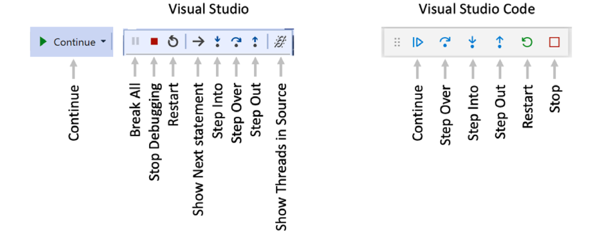

# Ch4 - Writing, Debugging, and Testing Functions
## Notes from Chapter 4 "C# 10 and .NET 6" by Mark J. Price

## Contents
Return [Home](README.md)
* [4.1 - Don't Repeat Yourself (DRY)](#04.1)
* [4.2 - Factorials with Recursion](#04.2)
* [4.3 - XML Comments](#04.3)
* [4.4 - Lambdas: Imperative vs Declarative](#04.4)


* [4.15 - Question & Answer](#04.11)

The code for this tutorial can be found in ``code/Chapter04``

---
<a name="04.1"></a>
### 4.1 - Don't Repeat Yourself (DRY)

* Use functions to avoid writing the same code again.
* Create a function that given an integer outputs the timetable for that value up to 12:
    ```C#
    using static System.Console;
    public class TimesTableApp
    {
        public static void Main(string[] args)
        {
            getTimesTable(11);
        }
        
        private static void getTimesTable(int xVal)
        {
            for (int x = 1; x <= 12; x++) 
            { 
            WriteLine($"{xVal} x {x} = {x * xVal}");
            }
            
            string xValString = xVal.ToString();
        }
    }
    ```
* In my example, I use ``int xVal`` but it is better to use strong types to add constraints to values. We know we will only need the range of timetables 1-15, therefore instead of ``int`` with range of -2,147,483,648 to 2,147,483,647, it would be more appropriate to use ``byte xVal``, with range of 0 to 255.
* Below we will write a function that returns a value, and uses a switch case:
    ```C#
    public class CalculateTaxApp
    {
        public static void Main(string[] args)
        {
            decimal taxToPay = CalculateTax(amount: 1000, twoLetterRegionCode: "GB");
            WriteLine($"You must pay {taxToPay} in tax.");
        }
        static decimal CalculateTax(
        decimal amount, string twoLetterRegionCode)
        {
            decimal rate = 0.0M;
            switch (twoLetterRegionCode)
            {
                case "CH": // Switzerland
                    rate = 0.08M;
                    break;
                case "GB": // United Kingdom
                case "FR": // France
                    rate = 0.2M;
                    break;
                case "OR": // Oregon
                case "AK": // Alaska
                case "MT": // Montana
                    rate = 0.0M;
                    break;
                case "ND": // North Dakota
                case "WI": // Wisconsin
                case "ME": // Maine
                case "VA": // Virginia
                    rate = 0.05M;
                    break;
                default: // most US states
                    rate = 0.06M;
                    break;
            }
            return amount * rate;
        }
    }
    ```
* As you can see for ``GB`` case it would have a rate of ``0.02M`` because there is no ``break``, and the program flows to the next case.


---
<a name="04.2"></a>
### 4.2 - Factorials with Recursion
* Use recursion to find factorials:
    ```C#
    static int Factorial(int i) 
    {
        if (i < 1)
        {
            return 0;
        }
        else if (i == 1)
        {
            return 1;
        }
        else
        {
            return i * Factorial(i - 1);
        }
    }
    ```
* As you can see the edge case of ``i < 0`` is covered. 
* However, if the output value is very high (e.g. ``Factorial(45)``), that it exceeds the ``int`` range, then remember that it cycles back to negative values a.k.a overflows. According to our function, the output of ``Factorial(45) = 0`` which is incorrect. We can make it throw an exception by using ``checked``.
    ```C#
    ....
    else
    checked
    {
        return i * Factorial(i - 1);
    }
    ```
* Lets write another function to print out the first 20 factorials. Also, we will now handle ``OverflowException``:
    ```C#
        static void Main(string[] args)
        {
            RunFactorial(20); 
        }
        static void RunFactorial(int nVals)
        {
            for (int i = 1; i <= nVals; i++)
                try
                {
                    WriteLine($"{i}! = {Factorial(i):N0}");
                }
                catch (System.OverflowException)
                {
                    WriteLine($"{i}! is too big for a 32-bit integer.");
                }
        }
        static int Factorial(int i)
        {
            if (i < 1)
            {
                return 0;
            }
            else if (i == 1)
            {
                return 1;
            }
            else
            checked
            {
                return i * Factorial(i - 1);
            }
        }
    ```
* The output:
    ```
    1! = 1
    2! = 2
    3! = 6
    4! = 24
    5! = 120
    6! = 720
    7! = 5,040
    8! = 40,320
    9! = 362,880
    10! = 3,628,800
    11! = 39,916,800
    12! = 479,001,600
    13! is too big for a 32-bit integer.
    14! is too big for a 32-bit integer.
    15! is too big for a 32-bit integer.
    16! is too big for a 32-bit integer.
    17! is too big for a 32-bit integer.
    18! is too big for a 32-bit integer.
    19! is too big for a 32-bit integer.
    20! is too big for a 32-bit integer.
    ```
---
<a name="04.3"></a>
### 4.3 - XML Comments
* Triple slash for XML comments which can be seen by hovering on the function when used.
* For a Cardinal to Ordinal function, on top of the function we can put an XML comment:
    ```C#
    /// <summary>
    /// Pass a 32-bit integer and it will be converted into its ordinal equivalent.
    /// </summary>
    /// <param name="number">Number is a cardinal value e.g. 1, 2, 3, and so on.</param>
    /// <returns>Number as an ordinal value e.g. 1st, 2nd, 3rd, and so on.</returns>
    static string CardinalToOrdinal(int number) 
        {
    ....
    ```
* Now, if you hover on the function name when you use ``WriteLine(CardinalToOrdinal(i));``, you will see something like this:

> 

* [Click here for the code example](https://github.com/vinush-vigneswaran/c-sharp-notes/blob/main/code/Chapter04/Cardinal2OrdinalApp/Program.cs)


---
<a name="04.4"></a>
### 4.4 - Lambdas: Imperative vs Declarative
* Lambda expressions are used to create an anonymous function.
#### **Anonymous function :** 
* This is done using the "lambda declaration operator": ``=>``
* Expression Lambda:
    ```
    (input-parameters) => expression
    ```
* Statement Lambda:
    ```
    (input-parameters) => { <sequence-of-statements> }
    ```
#### **Imperative vs Declarative**
* Let's look at code to generate the nth term of Fibonacci sequence:
* The imperative style is:
    ```C#
    static int FibImperative(int term)
    {
        if (term == 1)
        {
            return 0;
        }
        else if (term == 2)
        {
            return 1;
        }
        else
        {
            return FibImperative(term - 1) + FibImperative(term - 2);
        }
    }
    ```
* The declarative style is:
    ```C#
    static int FibFunctional(int term) =>
    term switch
    {
        1 => 0,
        2 => 1,
        _ => FibFunctional(term - 1) + FibFunctional(term - 2)
    };
    ```
* The style above is known as "expression-bodied function members", where it is very concise and readable (using ``=>``). Examples, include:
    ```C#
    ....
   public override string ToString() => $"{fname} {lname}".Trim();
    ....
   public void DisplayName() => Console.WriteLine(ToString());
    ```

---
<a name="04.5"></a>
### 4.5 - Debugging during development
* Breakpoints allow us to mark a line of code that we would like to pause at to inspect the program state and find bugs.
* Debug Environment:
1. Set a ``breakpoint`` by either **Debug | Toggle Breakpoint** or ``press F9`` or move to the left margin of that line to set a red circle.
2. Navigate to **Debug | Start Debugging** or **press F5**.
3. ``Break mode`` is when Visual Studio starts the console, but then pauses at the breakpoint
4. The windows can be accessed through **Debug > Windows**, then: 
    * ``Locals`` : Shows current values of all local variables.
    * ``Watch`` : Shows any watch expressions you have defined.
    * ``Call Stack``: Shows stack of function calls.
5. At the top the toolbar will change to debug mode.
6. The next line is highlight in yellow.

* This is the toolbar labels:
    * ``continue``: This button will continue running the program from the current position until it ends or hits another breakpoint.
    * ``restart``: Restarts the program and debugging from the beginning.
    * ``Step into``: This steps into the method, so that you can look through every line in the method.
    * ``Step over``: This runs the method in one go - you do not step into the method line-by-line.
    * ``Step out``: This advances the debugger out of the current function
> 


---
<a name="04.6"></a>
### 4.6 - Logging during development
Some framework for logging include: 
* Apache log4net
* NLog
* Serilog

There are also included classes to add simple logging to the code:
* ``Debug`` class is used to log only during development.
* ``Trace`` class is used to add logging that is used during both development and runtime.

How it works:
* Both of these classes write to a *trace* listener, there are many provided by .NET including one that outputs to the console.
* ``DefaultTraceListener`` class is configured to output to the DEBUG CONSOLE window

You can use the following code to log into a text file:
```C#
    // write to a text file in the project folder

    Trace.Listeners.Add(new TextWriterTraceListener(File.CreateText(Path.Combine(Environment.GetFolderPath(Environment.SpecialFolder.DesktopDirectory), "log.txt"))));

    // text writer is buffered, so this option calls
    // Flush() on all listeners after writing
    Trace.AutoFlush = true;

    Debug.WriteLine("Debug says, I am watching!");
    Trace.WriteLine("Trace says, I am watching!");
```

* ``Debug``: Select Debug in the Solution Configurations **dropdown** list and then run the console app by navigating to ``Debug | Start Debugging.``
* ``Release``: Run the release configuration of the console app by navigating to ``Debug | Start Without Debugging.``


---
<a name="04.7"></a>
### 4.7 - Writing Unit Tests
* In the example we use XUnit, by creating an XUnit project (as CalculatorTests) and adding a reference to the project we are testing (i.e. Calculator).
* A unit test consists of three parts:
    * ``Arrange`` : This part decleares and instantiates variables for input/desired output. 
    * ``Act`` : This part will execute the unit you are testing (i.e. the method which we are trying to test will get called).
    * ``Assert`` : This will make an assertion that the method output is the desired output.


---
<a name="04.8"></a>
### 4.8 - Throwing & Catching Exceptions and the Call Stack 
* **Call Stack**
    * The call stack is shown from the most recent function call, all the way up every function up until Main().
    * If there is an exception thrown at the most recent function call, it goes up the call stack looking for a try-catch block to handle the exception.
    * If there are no try-catch block then .NET outputs the exception and the call stack details.

* **Rethrowing an Exception**
    * To throw the caught exception with its original call stack, call ``throw``.
    * To rethrow the caught exception as though it was at the current level of the stack use ``throw ex``. This is poor practice because you lose information for debugging.
    * To wrap the current exception into another exception that includes more info (for the caller to understand the issue). In this case, you can use: ``innerException`` parameter.

Examples:
```C#
    try
    {
    Gamma();
    }
        catch (IOException ex)
    {
        LogException(ex);

        // throw the caught exception as if it happened here
        // this will lose the original call stack
        throw ex;

        // rethrow the caught exception and retain its original call stack
        throw;

        // throw a new exception with the caught exception nested within it
        throw new InvalidOperationException(
        message: "Calculation had invalid values. See inner exception for why.",
        innerException: ex);
    }
```


---
<a name="04.11"></a>
### 4.11 - Question & Answer
<br>

<details>
<summary><b> 1. What is a functional language? and show example.</b></summary>
<br>

* Function languages evolved from lambda calculus (computational system based on functions)
* Some of the important attributes are modularity, immutability and maintainability.
* Example of functional-first program is F#, and purely functional is Haskell.
* Example of Pure Function:
    ```
    Function Pure(a,b)
    {
        return a+b;
    }
    ```
* Example of Impure Functions:
    ```
    int z;
    function notPure(){
        z = z+10;
    }
    ```
<br><br>
</details>


<details>
<summary><b> 2. Describe the important attributes of a functional language</b></summary>
<br>

* ``Modularity``: Similar to C#, we can break down large complex codes into reusable smaller pieces of code.
* ``Immutability``: With functional languages, data values of variables inside a function cannot be changed instead the new data balue has to be created from existing ones. This reduces bugs.
* ``Maintainability``: Code is cleaner and clearer.
<br><br>
</details>


<details>
<summary><b> 3. What does the C# keyword void mean?</b></summary>
<br>

* ``void`` means that the function/method does not return anything.
<br><br>
</details>


<details>
<summary><b> 4. In Visual Studio Code or Visual Studio, what is the difference between pressing F5, Ctrl or Cmd + F5, Shift + F5, and Ctrl or Cmd + Shift + F5?</b></summary>
<br>

* ``F5`` runs the code in debug mode.
* ``Ctrl+F5`` runs the code without debug mode.
* The same in VS with an additional ``Shift`` command.
<br><br>
</details>

<details>
<summary><b> 5. Where does the Trace.WriteLine method write its output to?</b></summary>
<br>

* ``Trace.WriteLine`` : Writes its output to the ``debug`` output during development and runtime.
<br><br>
</details>

<details>
<summary><b> 6. What are the five trace levels?</b></summary>
<br>

* Trace Error
* Trace Warning
* Trace Info
* Trace Verbose
<br><br>
</details>

<details>
<summary><b> 6. What is the difference between the Debug and Trace classes?</b></summary>
<br>

* ``Trace`` : Used to log during development and runtime
* ``Debug`` : Used only to log during development
<br><br>
</details>


<details>
<summary><b> 7. When writing a unit test, what are the three "A"s?</b></summary>
<br>

* Arrange, Act and Assert
<br><br>
</details>

<details>
<summary><b> 8. When writing a unit test using xUnit, what attribute must you decorate the test methods with?</b></summary>
<br>

```C#
[Fact]
```
<br><br>
</details>

<details>
<summary><b> 9. What statement should you use to rethrow a caught exception named ex without losing the stack trace?</b></summary>
<br>

* ``throw``
<br><br>
</details>


